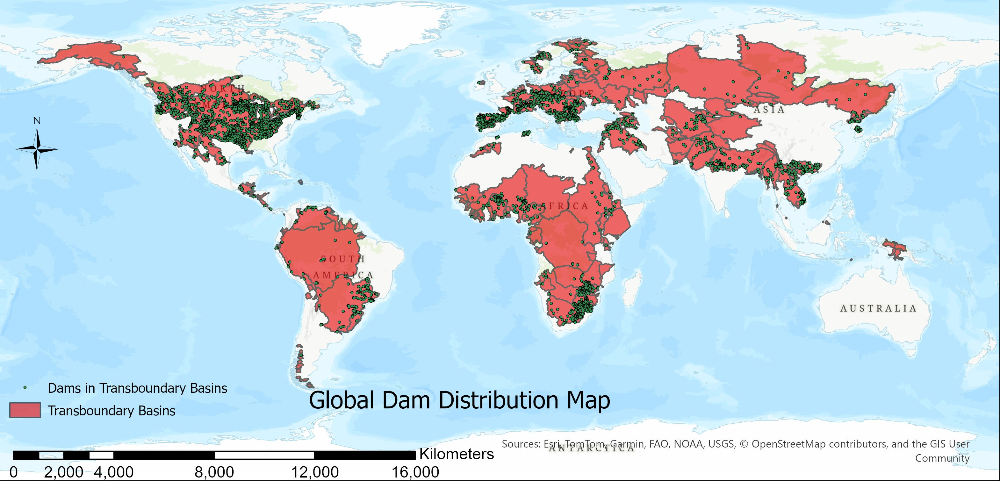
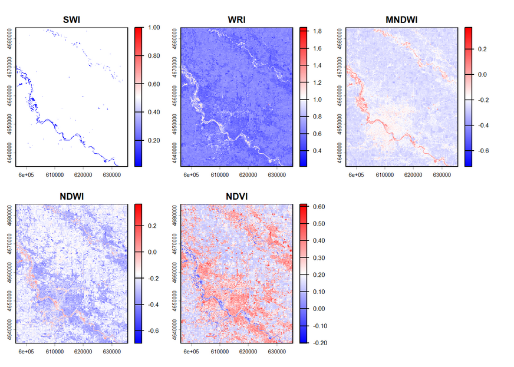

**1.** **Evaluating Transboundary Water Governance by Dam Construction Trends. (2024- 2025) Colorado State University, Fort Collins, Colorado, USA.**

-   [Policies for Establishing a Guideline to Protect the Ecological Flows in NC, USA.](https://apnep.nc.gov/documents/files/projects/ap-ecological-flows-phase-ii-report) (APNEP funded project) (2022- 2023) East Carolina University, Greenville, North Carolina, USA.

    {width="778"}

**2. Water Quality Analysis in the Khoda Afarin Transboundary Reservoir, Iran.**

{fig-align="center" width="803"}

**3. Assessing the Environmental Effects and Regulatory Influences of the Condit Dam Removal Process**

{width="708"}

**4. Flow Analysis in Colorado River Basin**

This project examines daily streamflow records from seven U.S. Geological Survey gauges in the Colorado River Basin from 1980 to 2023, using R and the dataRetrieval package to retrieve NWIS data directly. The analysis progresses from raw discharge to a series of hydrological questions, including computing day-over-day flow changes, normalizing discharge by drainage area to allow cross-basin comparisons, monitoring low-flow thresholds using the 7-day rolling mean against historical baselines, and characterizing seasonal runoff regimes defined by the basin's two dominant pulses — Rocky Mountain snowmelt and Arizona-New Mexico monsoon. Spatial analysis shows how the flow-weighted geographic center of the basin has migrated northward over four decades, showing severe drying of southern tributaries. This analysis includes a predictive linear model that uses Glenwood Springs upstream conditions to forecast annual discharge at Lees Ferry, the Colorado River Compact's major accounting point, complete with log-log elasticity interpretation and comprehensive residual diagnostics. These calculations show how a warming climate is changing the timing, quantity, and spatial distribution of Colorado Basin flow, with consequences for interstate water delivery obligations under the 1922 Compact.

**5. Flood Extent Mapping with Remote Sensing**

In this project I used Landsat 8 satellite imagery to map the flood extent of the September 2016 Cedar River flood event near Palo, Iowa. Using R, I accessed and downloaded multispectral imagery through Microsoft Planetary Computer's STAC API, and applied five spectral index methods (NDVI, NDWI, MNDWI, WRI, and SWI) alongside an unsupervised K-Means clustering algorithm to detect and classify flooded areas. The results were compared across all six methods to assess uncertainty in flood classification, revealing that methods disagreed most at the margins of the flood extent, where shallow water, wet soil, and urban surfaces create ambiguous spectral signatures. The project demonstrated how satellite imagery and raster analysis can be used to rapidly assess flood extents in areas without real-time monitoring, which has direct applications in disaster response, damage assessment, and flood inundation mapping efforts by agencies like NOAA, USGS, and FEMA.

**Skills used:** R, terra, rstac, sf, Remote Sensing, Raster Analysis, K-Means Clustering, STAC API

